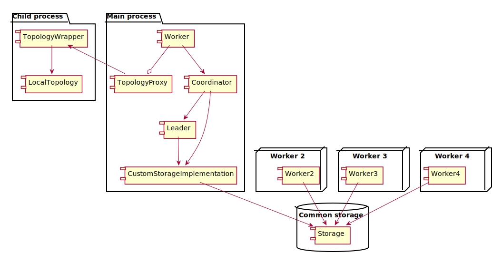
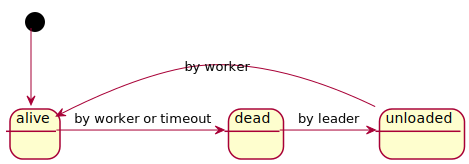
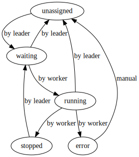
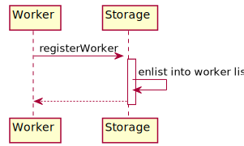
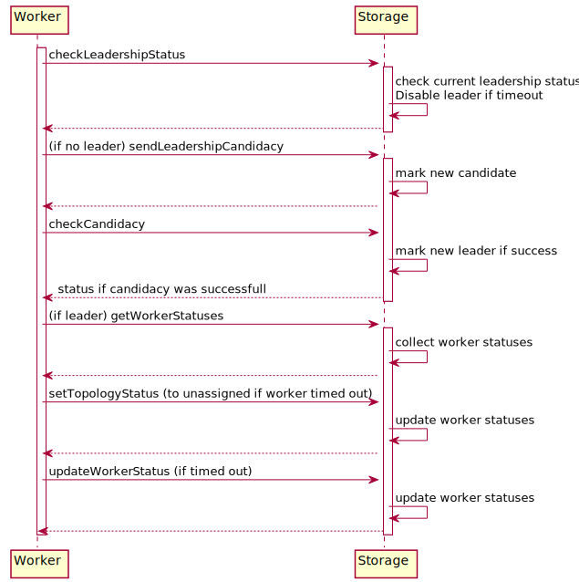
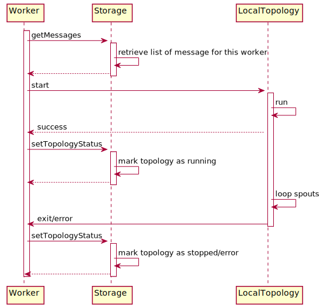

# Topology protocol

The following components comprise the distributed setting for `qtopology`:

## Worker

Ideally, runs as single instance on single server (but there is no obstacle to having several workers on single machine). It needs the following:

- logical name
- method of coordination

It then creates an instance of a coordinator, passes to it the method of coordination and awaits instructions. These include command `start`, which starts the topology with provided definition.

## Coordinator

A subordinate class of worker - takes care of coordination with other workers.

- Listens for messages, addressed to this worker
    - `start_topology`
    - `stop_topology`
    - `kill_topology`
    - `shutdown`
    - `rebalance`
- Updates statuses of worker's topologies inside coordination storage
- Updates status of worker inside coordination storage

It also contains a subordinate class that handles leadership checks and repated tasks.

## Local topology

This object:

- starts nodes (spouts and bolts)
- sends them commands, e.g. `init`, `run`, `pause`, `shutdown`

## Status transitions

### Worker statuses

### Topology statuses

## Sequence between coordinator, worker and local topology

The worker first performs the initialization sequence and the runs two sequences in parallel, infinite loops:

- Leadership sequence
- Normal active-worker sequence

### Initial sequence

| Coordination storage | Worker |
|-------------|--------|
|  | Register worker |
| Puts worker in worker list  |  |

### Leadership sequence

| Coordination storage | Worker
|-------------|--------|
|  | Checks if leadership is established |
| Returns leadership status |  |
|  | If leadership is ok, do nothing else |
|  | Sends leadership candidacy |
| Registers candidacy |  |
|  | Checks candidacy |
| Sends `true` if candidacy sucessfull |  |
|  | If not elected leader, do nothing more |
|  | Gets worker statuses |
| Returns worker statuses after marking those with overdue pings as `dead` | |
| | For all `dead` workers unassigns their topologies |
| Updates statuses for these topologies | |
| | Pronounces `dead` workers as `unloaded` |
| Stores new worker statuses | |
| | Gets topology statuses |
| Gets topology statuses after setting overdue `waiting` status to `unassigned` and setting topologies of `dead` worker to `unassigned`  | |
| | Assigns `unassigned` and `stopped` topologies to new workers by setting the to status `waiting` |
| Stores new statuses for these topologies | |
| Stores messages for workers to load topologies | |

### Active-worker sequence

| Coordination storage | Worker |
|-------------|--------|
|  | Get messages for this worker |
| Returns messages for this worker |  |
|  | Handle message such as "start topology" or "shutdown" |
| Update topology status if start successful |  |

